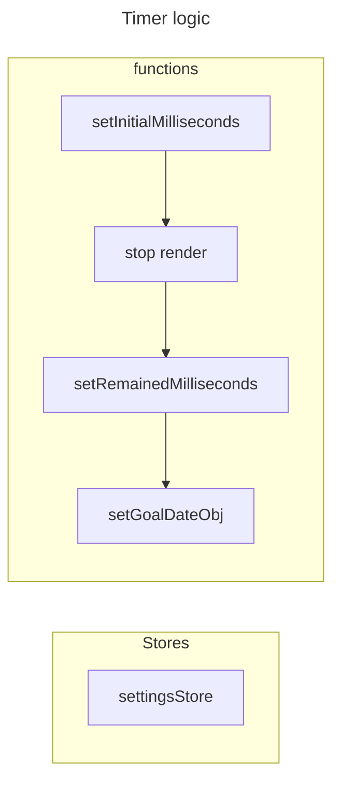

```mermaid
---
title: Timer logic
---
flowchart LR
    subgraph Stores
        settingsStore
    end

    subgraph functions
        setInitialMilliseconds
            -->setIsRunningFalse[stop render]
            -->setRemainedMilliseconds
            -->setGoalDateObj
        end
```